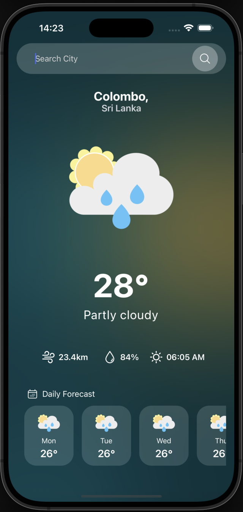
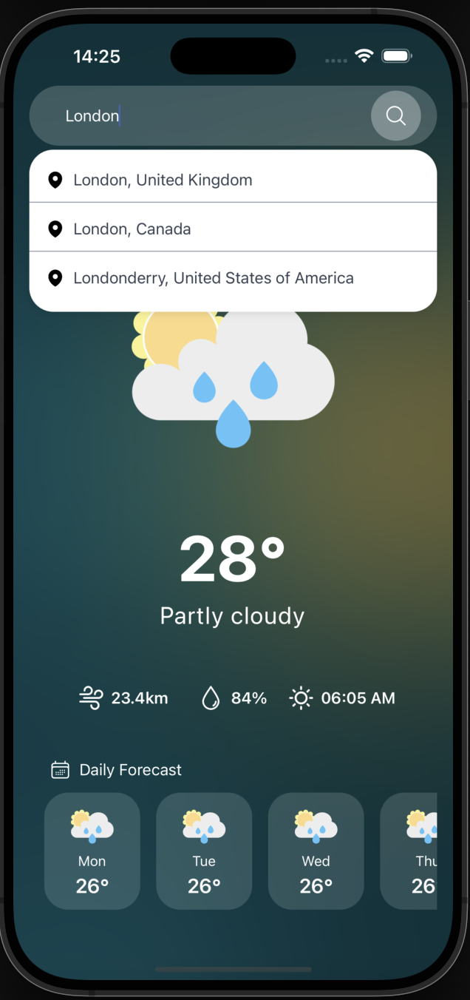
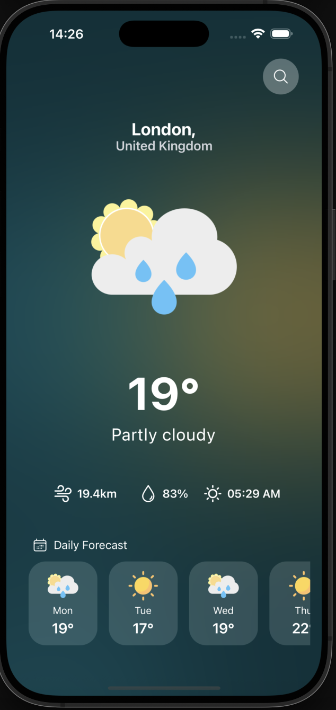

# Climate App 🌤️

A modern weather application built with React Native and Expo that provides real-time weather information and 7-day forecasts for cities worldwide.

## 📱 Features

- **Real-time Weather Data**: Get current weather conditions including temperature, humidity, wind speed, and sunrise time
- **7-Day Forecast**: View upcoming weather forecasts with daily temperatures and conditions
- **City Search**: Search and select from thousands of cities worldwide
- **Dynamic Weather Icons**: Icons change based on actual weather conditions
- **Beautiful UI**: Modern design with smooth animations and gradients
- **Loading States**: Elegant loading animations using react-native-progress
- **Responsive Design**: Optimized for both iOS and Android devices

## 🛠️ Tech Stack

- **Framework**: React Native with Expo
- **Language**: JavaScript
- **Navigation**: React Navigation v7
- **HTTP Client**: Axios
- **Icons**: React Native Heroicons
- **Utilities**: Lodash (for debouncing)
- **Progress Indicators**: React Native Progress
- **Weather API**: WeatherAPI.com

## 📦 Dependencies

### Core Dependencies
```json
{
  "react": "18.2.0",
  "react-native": "0.79.5",
  "expo": "~53.0.17",
  "@react-navigation/native": "^7.x.x",
  "@react-navigation/native-stack": "^7.x.x",
  "axios": "latest",
  "lodash": "latest",
  "react-native-heroicons": "latest",
  "react-native-progress": "latest"
}
```

## 🚀 Installation & Setup

### Prerequisites
- Node.js (v18 or higher)
- npm or yarn
- Expo CLI
- iOS Simulator (for iOS development)
- Android Studio (for Android development)

### 1. Clone the Repository
```bash
git clone https://github.com/Mindi-R/Climate-App.git
cd Climate-app
```

### 2. Install Dependencies
```bash
npm install
```

### 3. Setup Weather API
1. Sign up at [WeatherAPI.com](https://www.weatherapi.com/)
2. Get your free API key
3. Update the API key in `constants/index.js`:
```javascript
export const apiKey = 'your-api-key-here';
```

### 4. Start the Development Server
```bash
npx expo start
```

### 5. Run on Device/Simulator
- **iOS**: Press `i` in the terminal or scan QR code with iOS Camera
- **Android**: Press `a` in the terminal or scan QR code with Expo Go app
- **Web**: Press `w` in the terminal

## 📁 Project Structure

```
Climate-app/
├── App.js                 # Main app component
├── index.js              # App entry point
├── app.json              # Expo configuration
├── package.json          # Dependencies and scripts
├── assets/               # Static assets
│   ├── images/           # Weather condition images
│   │   ├── bg.png
│   │   ├── sun.png
│   │   ├── cloud.png
│   │   ├── partlycloudy.png
│   │   ├── moderaterain.png
│   │   └── heavyrain.png
│   └── icons/            # UI icons
│       ├── wind.png
│       ├── drop.png
│       └── sun.png
├── api/                  # API integration
│   └── weather.js        # Weather API functions
├── constants/            # App constants
│   └── index.js          # API keys and weather images mapping
├── Navigation/           # Navigation setup
│   └── appNavigation.js  # Navigation container and stack
├── Screens/              # App screens
│   └── HomeScreen.js     # Main weather screen
└── theme/                # Theme configuration
    └── theme.js          # Colors and styling utilities
```

## 🔧 Configuration

### Weather Images Mapping
The app uses local images for weather conditions. Update the mapping in `constants/index.js`:

```javascript
export const weatherImages = {
    'Partly Cloudy': require('../assets/images/partlycloudy.png'),
    'Moderate Rain': require('../assets/images/moderaterain.png'),
    'Sunny': require('../assets/images/sun.png'),
    'Clear': require('../assets/images/sun.png'),
    'Overcast': require('../assets/images/cloud.png'),
    // ... more mappings
};
```

### Theme Configuration
Customize colors and styles in `theme/theme.js`:

```javascript
export const theme = {
  bgwhite: (opacity) => `rgba(255,255,255, ${opacity})`,
  // Add more theme properties
};
```

## 🌟 Key Features Breakdown

### Weather Search
- Debounced search input (1.2s delay)
- Real-time city suggestions
- Search results with country information
- Smooth dropdown animations

### Weather Display
- Large temperature display
- Current weather condition text
- Weather condition icons
- Statistics row (wind, humidity, sunrise)

### 7-Day Forecast
- Horizontal scrollable forecast cards
- Day names (Mon, Tue, Wed, etc.)
- Daily average temperatures
- Weather condition icons for each day

### Loading States
- Beautiful circular progress indicator
- Smooth transitions between loading and content
- Loading shown when switching cities

## 🎨 Styling

The app uses React Native StyleSheet for styling with:
- Flexbox layouts
- Custom color schemes
- Responsive design principles
- Platform-specific optimizations

## 📱 Screenshots

### Home Screen
<div align="center">
  
</div>

### Search Functionality
<div align="center">
  
</div>

### 7-Day Forecast
<div align="center">
  
</div>

## 🔄 API Integration

### Weather API Endpoints Used
1. **Current Weather + Forecast**:
   ```
   GET https://api.weatherapi.com/v1/forecast.json
   ```

2. **City Search**:
   ```
   GET https://api.weatherapi.com/v1/search.json
   ```

### API Features
- 7-day weather forecast
- Real-time weather data
- City/location search
- Weather condition codes and icons
- Astronomical data (sunrise)

## 🐛 Known Issues & Solutions

### Common Issues
1. **Metro bundling errors**: Run `npx expo start --clear`
2. **Icon not loading**: Check internet connection and API key
3. **Search not working**: Verify API key is correctly set

## 🚀 Building for Production

### iOS
```bash
expo build:ios
```

### Android
```bash
expo build:android
```

## 🔗 Links

- **Repository**: [https://github.com/Mindi-R/Climate-App](https://github.com/Mindi-R/Climate-App)
- **Weather API**: [WeatherAPI.com](https://www.weatherapi.com/)
- **Expo Documentation**: [Expo.dev](https://expo.dev/)
- **React Native Guide**: [React Native](https://reactnative.dev/)

## 🙏 Acknowledgments

- [WeatherAPI.com](https://www.weatherapi.com/) for providing weather data
- [React Native Heroicons](https://github.com/EvanBacon/react-native-heroicons) for beautiful icons
- [Expo](https://expo.dev/) for the development platform

---

**Built with ❤️ using React Native and Expo**
